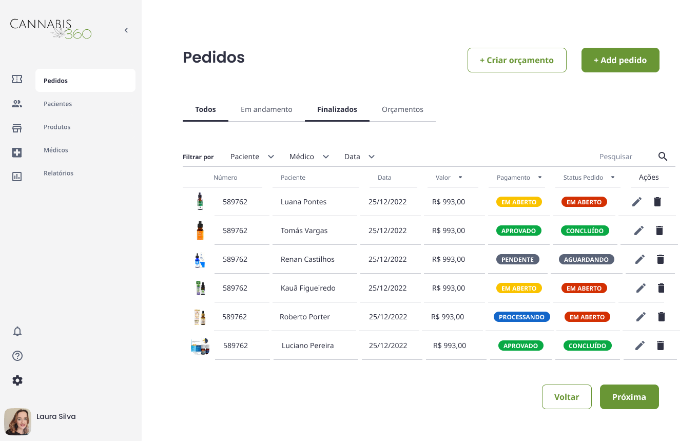
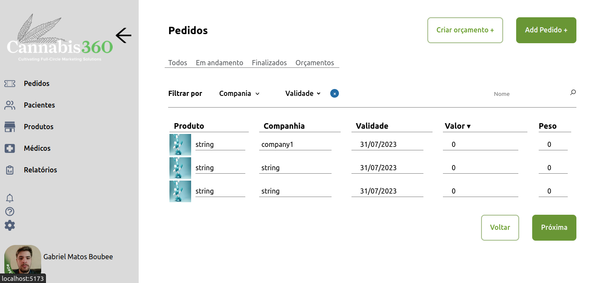

# Teste tecnico

Este é um projeto base utilizando Vite, uma ferramenta de construção rápida para aplicações web modernas. O projeto utiliza React como biblioteca de componentes para a criação de interfaces e várias outras dependências úteis para o desenvolvimento web.

## Descrição dos Diretórios

- **`public`**: Este diretório contém os arquivos públicos da aplicação, como o arquivo HTML principal e outros recursos estáticos que podem ser acessados diretamente pelo navegador.

- **`src`**: Este é o diretório raiz da aplicação onde todo o código-fonte da aplicação é armazenado.

  - **`assets`**: Neste diretório são armazenados recursos de mídia, como imagens, ícones, etc.

  - **`components`**: Este diretório contém os componentes reutilizáveis da aplicação.

  - **`pages`**: Neste diretório são armazenadas as páginas da aplicação, que são compostas por componentes reutilizáveis e são responsáveis por renderizar as diferentes rotas da aplicação.

  - **`styles`**: Aqui ficam os arquivos de estilos globais da aplicação, como estilos CSS ou SCSS que são aplicados em toda a aplicação.

  - **`services`**: Neste diretório são armazenados recursos de comunicação com a api. Exemplo: fetch("url").

  - **`interfaces`**: Este diretório contém arquivos de definições de tipos customizados para a aplicação. É útil para definir tipos que serão utilizados em vários lugares do projeto.

  - **`utils`**: Neste diretório são armazenados funções que podem ser reutilizadas no codigo e não precisam diretamente do react para funcionar. 

  - **`App.tsx`**: O arquivo `App.tsx` é o componente raiz da aplicação, que contém o roteamento principal e a estrutura geral da aplicação.

  - **`index.tsx`**: O arquivo `index.tsx` é o ponto de entrada da aplicação, onde o React é inicializado e a aplicação é renderizada no DOM.

## Considerações Finais

A estrutura de pastas adotada no projeto `cannabis360-test` é organizada e modular, facilitando a manutenção e expansão do código. Cada diretório tem uma função específica, o que torna mais fácil para desenvolvedores entenderem onde encontrar cada parte do código da aplicação. É importante seguir uma organização bem definida para garantir a escalabilidade e a legibilidade do código ao longo do tempo.
## Scripts

Os seguintes scripts estão disponíveis para a execução de tarefas específicas:

- `dev`: Inicia o servidor de desenvolvimento para execução local.
- `build`: Realiza o build da aplicação para produção.
- `lint`: Executa o linting para verificar e corrigir erros de código.
- `preview`: Inicia o servidor para visualização do build de produção.

## Dependências

As principais dependências utilizadas no projeto são:

- React: Biblioteca de componentes para a criação de interfaces.
- React DOM: Renderização do React para a web.
- React Icons: Conjunto de ícones para utilização em componentes React.
- React Query: Biblioteca para gerenciamento de dados em aplicações React.
- React Router DOM: Biblioteca para controle de rotas em aplicações React.
- React Datepicker: Componente de seleção de datas para aplicações React.

## Dev Dependencies

As dependências de desenvolvimento incluem:

- TypeScript: Superset de JavaScript com suporte a tipos estáticos.
- Vite: Ferramenta de construção rápida para aplicações web modernas.
- ESLint: Ferramenta de linting para garantir a qualidade do código.
- @typescript-eslint/eslint-plugin: Plugin do ESLint para integração com TypeScript.
- @typescript-eslint/parser: Parser do ESLint para analisar arquivos TypeScript.
- @vitejs/plugin-react: Plugin Vite para suporte a React.
- ESLint Plugin React Hooks: Plugin do ESLint para linting de React Hooks.
- ESLint Plugin React Refresh: Plugin do ESLint para suporte a React Refresh.

## Instruções de Uso

1. Clone este repositório em sua máquina local.
2. Navegue até o diretório do projeto.
3. Execute o comando `npm install` para instalar as dependências.
4. Utilize os scripts definidos no `package.json` para as tarefas de desenvolvimento e produção.

Sinta-se à vontade para expandir e personalizar este projeto base para atender às suas necessidades específicas de desenvolvimento. Bom trabalho!
